Holobiont Population Genetics — Analysis Report
================
William Pearman
28 April 2026

- [Overview](#overview)
- [Section A — Importance mutation
  experiment](#section-a--importance-mutation-experiment)
  - [A1. Load extracted per-combo
    files](#a1-load-extracted-per-combo-files)
  - [A2. Late-window summaries](#a2-late-window-summaries)
  - [A3. Importance-trajectory plot](#a3-importance-trajectory-plot)
  - [A4. Variance ratio vs evolved
    importance](#a4-variance-ratio-vs-evolved-importance)
  - [A5. Microbiome rescue effect
    (`step_gen50`)](#a5-microbiome-rescue-effect-step_gen50)
  - [A6. Effective selection vs evolved
    importance](#a6-effective-selection-vs-evolved-importance)
  - [A7. Combined three-panel headline
    figure](#a7-combined-three-panel-headline-figure)
  - [A8. Supplementary trajectory across all
    EnvTypes](#a8-supplementary-trajectory-across-all-envtypes)
  - [A9. Statistical models](#a9-statistical-models)
- [Section B — Standard experiment](#section-b--standard-experiment)
  - [B1. Heatmap helpers](#b1-heatmap-helpers)
  - [B2. Heatmap figures](#b2-heatmap-figures)
  - [B3. Importance-as-linear-predictor plots (`step_gen50`, X =
    0.9)](#b3-importance-as-linear-predictor-plots-step_gen50-x--09)
  - [B4. Three-row metric grid (`step_gen50`, faceted by
    importance)](#b4-three-row-metric-grid-step_gen50-faceted-by-importance)
- [Saved figures](#saved-figures)
- [Session info](#session-info)

# Overview

This report reproduces the analysis figures from the holobiont
population-genetics simulation sweep, working from the *intermediate
extracted data* produced by the SLURM extraction array jobs and (for the
standard sweep) the aggregated per-generation dataset.

It is split into two sections that mirror the two experiments in the
repo:

1.  **Importance mutation** (`importance_mutation/`) — sweeps vertical
    inheritance × env-change-rate at fixed initial importance = 0, with
    importance allowed to mutate. Inputs: per-combo extracted summaries
    in `extracted_varratio/` and `extracted_seff/` under the results
    dir.
2.  **Standard** (`standard/`) — sweeps vertical inheritance ×
    env-change-rate × *fixed* initial importance values. Input:
    `combined_data_all_aggregated.RDS`.

To knit:

``` r
rmarkdown::render(
  "analysis/analysis_report.Rmd",
  params = list(
    importance_results_dir = "/nesi/nobackup/uoa04039/Holobiont_PopGen/Simulations_26Nov/simulations_pogen_heatwave/Rerun_sims_array_28Nov/Importance_Mutation/results_importance_mutation_standard_rerun",
    standard_aggregated_data = "/nesi/nobackup/uoa04039/Holobiont_PopGen/Simulations_26Nov/simulations_pogen_heatwave/Rerun_sims_array_28Nov/combined_data_all_aggregated.RDS",
    env_file="/nesi/nobackup/uoa04039/Holobiont_PopGen/Simulations_26Nov/simulations_pogen_heatwave/holobiont-popgen/data/env_list_rerun.RDS"
  )
)
```

The standard section is skipped automatically if
`standard_aggregated_data` is empty or the file is missing.

``` r
suppressPackageStartupMessages({
  library(dplyr)
  library(readr)
  library(tidyr)
  library(ggplot2)
  library(patchwork)
  library(broom)
  library(knitr)
  library(stringr)
})

theme_set(theme_bw(base_size = 10) +
  theme(strip.background = element_rect(fill = "grey92"),
        panel.grid.minor = element_blank()))
```

# Section A — Importance mutation experiment

``` r
varratio_dir <- file.path(IMP_DIR, "extracted_varratio")
seff_dir     <- file.path(IMP_DIR, "extracted_seff")
stopifnot(
  "extracted_varratio/ not found" = dir.exists(varratio_dir),
  "extracted_seff/ not found"     = dir.exists(seff_dir)
)
cat("Importance dir: ", normalizePath(IMP_DIR),  "\n",
    "varratio dir:   ", varratio_dir,            "\n",
    "seff dir:       ", seff_dir,                "\n", sep = "")
```

    ## Importance dir: /nesi/nobackup/uoa04039/Holobiont_PopGen/Simulations_26Nov/simulations_pogen_heatwave/Rerun_sims_array_28Nov/Importance_Mutation/results_importance_mutation_standard_rerun
    ## varratio dir:   /nesi/nobackup/uoa04039/Holobiont_PopGen/Simulations_26Nov/simulations_pogen_heatwave/Rerun_sims_array_28Nov/Importance_Mutation/results_importance_mutation_standard_rerun/extracted_varratio
    ## seff dir:       /nesi/nobackup/uoa04039/Holobiont_PopGen/Simulations_26Nov/simulations_pogen_heatwave/Rerun_sims_array_28Nov/Importance_Mutation/results_importance_mutation_standard_rerun/extracted_seff

## A1. Load extracted per-combo files

``` r
# Variance-ratio extracts
varratio_files <- list.files(varratio_dir,
                             pattern = "^combo_.*_varratio\\.RDS$",
                             full.names = TRUE)
cat(sprintf("Found %d varratio combo files\n", length(varratio_files)))
```

    ## Found 72 varratio combo files

``` r
var_data       <- lapply(varratio_files, read_rds)
var_summary    <- bind_rows(lapply(var_data, `[[`, "summary")) %>%
  filter(is.finite(evolved_imp), is.finite(delta_var_ratio)) %>%
  mutate(NGen_label = paste0("NGen = ", NGen)) %>%
  filter(EnvType %in% c("step_gen1", "step_gen5", "step_gen50"))
var_trajectory <- bind_rows(lapply(var_data, `[[`, "trajectory")) %>%
  filter(is.finite(var_ratio)) %>%
  mutate(NGen_label = paste0("NGen = ", NGen)) %>%
  filter(EnvType %in% c("step_gen1", "step_gen5", "step_gen50"))

# Effective-selection extracts
seff_files     <- list.files(seff_dir,
                             pattern = "^combo_.*_seff\\.RDS$",
                             full.names = TRUE)
cat(sprintf("Found %d seff combo files\n", length(seff_files)))
```

    ## Found 72 seff combo files

``` r
seff_data       <- lapply(seff_files, read_rds)
seff_summary    <- bind_rows(lapply(seff_data, `[[`, "summary"))
seff_trajectory <- bind_rows(lapply(seff_data, `[[`, "trajectory"))

cat(sprintf("var_summary rows:    %d\nvar_trajectory rows: %d\n",
            nrow(var_summary), nrow(var_trajectory)))
```

    ## var_summary rows:    360
    ## var_trajectory rows: 1080000

``` r
cat(sprintf("seff_summary rows:    %d\nseff_trajectory rows: %d\n",
            nrow(seff_summary), nrow(seff_trajectory)))
```

    ## seff_summary rows:    720
    ## seff_trajectory rows: 2160000

## A2. Late-window summaries

``` r
late_ratio <- var_trajectory %>%
  filter(importance_num == 0, selection_type == "Selective",
         !(X == 1 & EnvType == "step_gen1")) %>%
  group_by(combo_id, rep, NGen, X, EnvType, selection_type) %>%
  filter(generation > (max(generation) - LATE_WIN)) %>%
  summarise(
    late_var_ratio = mean(var_ratio, na.rm = TRUE),
    evolved_imp    = mean(mean_imp,  na.rm = TRUE),
    .groups = "drop"
  ) %>%
  filter(is.finite(late_var_ratio), is.finite(evolved_imp)) %>%
  mutate(NGen_label = paste0("NGen = ", NGen))

late_rescue <- var_summary %>%
  filter(importance_num == 0, selection_type == "Selective",
         !(X == 1 & EnvType == "step_gen1")) %>%
  mutate(rescue_effect = late_fitness - late_nomicro_fitness,
         NGen_label    = paste0("NGen = ", NGen)) %>%
  filter(is.finite(rescue_effect), is.finite(evolved_imp))

seff_late <- seff_trajectory %>%
  filter(generation %in% (max(generation) - LATE_WIN + 1):max(generation)) %>%
  group_by(importance_num, selection_type, EnvType, X, rep) %>%
  summarise(
    nominal_s = mean(as.numeric(S_host), na.rm = TRUE),
    evol_imp  = mean(mean_imp,           na.rm = TRUE),
    s_with    = mean(s_eff_with,         na.rm = TRUE),
    s_without = mean(s_eff_without,      na.rm = TRUE),
    s_ratio   = mean(s_ratio,            na.rm = TRUE),
    .groups   = "drop"
  ) %>%
  arrange(importance_num) %>%
  mutate(X = as.character(X))
```

## A3. Importance-trajectory plot

``` r
imp_traj_summary <- var_trajectory %>%
  filter(importance_num == 0, selection_type == "Selective") %>%
  group_by(generation, X, EnvType, NGen_label) %>%
  summarise(
    mean_importance = mean(mean_imp, na.rm = TRUE),
    sd_importance   = sd(mean_imp,   na.rm = TRUE),
    n_reps          = n(),
    .groups         = "drop"
  ) %>%
  mutate(se_importance = sd_importance / sqrt(n_reps),
         lower_se = mean_importance - se_importance,
         upper_se = mean_importance + se_importance)

p_imp_traj <- imp_traj_summary %>%
  filter(EnvType == "step_gen50") %>%
  ggplot(aes(x = generation, y = mean_importance,
             colour = factor(X), fill = factor(X), group = factor(X))) +
  geom_ribbon(aes(ymin = lower_se, ymax = upper_se), alpha = 0.2, colour = NA) +
  geom_line(linewidth = 0.7) +
  geom_vline(xintercept = 2000, linetype = "dashed", colour = "grey50") +
  scale_colour_brewer(palette = "Spectral",
                      name = expression(Vertical~Inheritance~(italic(X)))) +
  scale_fill_brewer(palette = "Spectral",
                    name = expression(Vertical~Inheritance~(italic(X)))) +
  labs(x = "Generation", y = "Mean Microbial Importance")
p_imp_traj
```

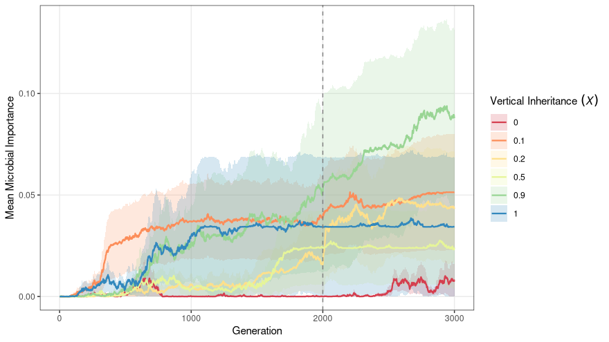

## A4. Variance ratio vs evolved importance

``` r
p_late <- ggplot(late_ratio,
                 aes(x = evolved_imp, y = late_var_ratio,
                     group = NGen_label, shape = NGen_label, colour = NGen_label)) +
  geom_point(size = 1.8, alpha = 0.6) +
  geom_smooth(method = "lm", se = TRUE, linewidth = 0.9) +
  scale_colour_discrete(name = "Microbial generations\nper host gen",
                        labels = function(x) sub("NGen = ", "", x)) +
  scale_shape_discrete(name = "Microbial generations\nper host gen",
                       labels = function(x) sub("NGen = ", "", x)) +
  labs(x = "Mean evolved importance (last 500 gens)",
       y = "Standard deviation ratio")
p_late
```

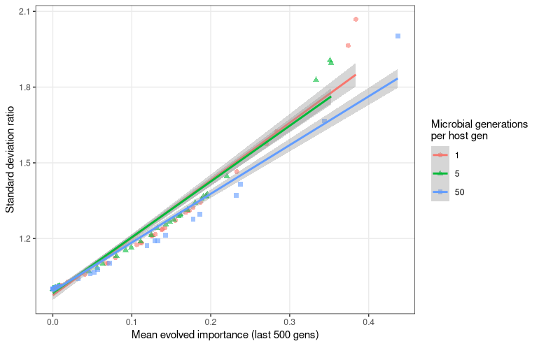

## A5. Microbiome rescue effect (`step_gen50`)

``` r
p_rescue <- ggplot(filter(late_rescue, EnvType == "step_gen50"),
                   aes(x = evolved_imp, y = rescue_effect)) +
  geom_point(size = 1.8, alpha = 0.6) +
  geom_smooth(method = "lm", se = TRUE, linewidth = 0.9, colour = "black") +
  labs(x = "Mean evolved importance (last 500 gens)",
       y = "Microbiome Rescue Effect")
p_rescue
```

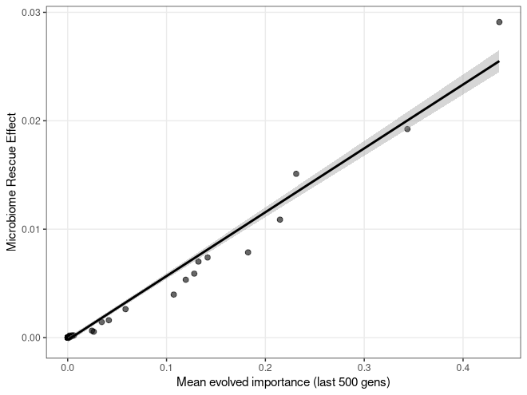

## A6. Effective selection vs evolved importance

``` r
eff_data <- seff_late %>%
  filter(selection_type == "Selective",
         EnvType %in% c("step_gen1", "step_gen5", "step_gen50"),
         !(X == "1" & EnvType == "step_gen1"))

make_eff_plot <- function(df, title = NULL) {
  ggplot(df, aes(x = evol_imp, y = s_with)) +
    geom_point(alpha = 0.6) +
    geom_smooth(method = "loess", se = FALSE, colour = "black") +
    labs(x = "Mean evolved importance (last 500 gens)",
         y = "Effective genotypic selection",
         title = title)
}

eff_plots <- lapply(c("step_gen1", "step_gen5", "step_gen50"), function(et) {
  make_eff_plot(filter(eff_data, EnvType == et), title = et)
})
names(eff_plots) <- c("step_gen1", "step_gen5", "step_gen50")

eff_sel_comb <- Reduce(`+`, eff_plots) +
  plot_layout(guides = "collect") +
  plot_annotation(tag_levels = "a") &
  theme(plot.tag = element_text(face = "bold"))
eff_sel_comb
```

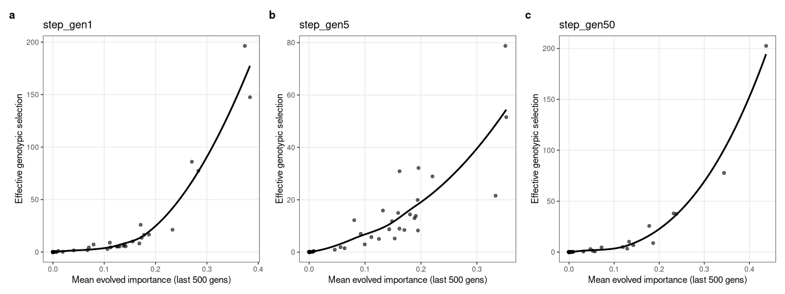

## A7. Combined three-panel headline figure

``` r
final_plot <- (p_imp_traj |
               (p_rescue +
                  scale_color_discrete(name = "Microbial generations\nper host gen",
                                       labels = c("1", "5", "50")) +
                  scale_shape_discrete(name = "Microbial generations\nper host gen",
                                       labels = c("1", "5", "50"))) |
               eff_plots[["step_gen50"]]) +
  plot_layout(guides = "collect") +
  plot_annotation(tag_levels = "a") &
  theme(plot.tag = element_text(face = "bold"),
        legend.position = "left")
final_plot
```

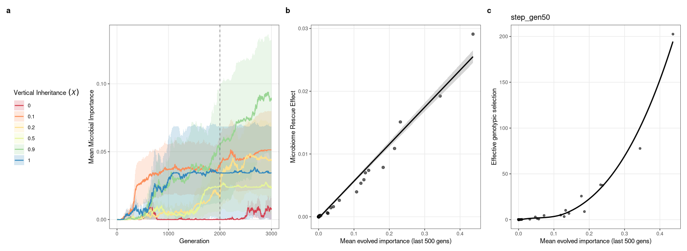

## A8. Supplementary trajectory across all EnvTypes

``` r
supp_p_imp_traj <- imp_traj_summary %>%
  ggplot(aes(x = generation, y = mean_importance,
             colour = factor(X), fill = factor(X), group = factor(X))) +
  geom_ribbon(aes(ymin = lower_se, ymax = upper_se), alpha = 0.2, colour = NA) +
  geom_line(linewidth = 0.7) +
  geom_vline(xintercept = 2000, linetype = "dashed", colour = "grey50") +
  scale_colour_brewer(palette = "Spectral", name = "Vertical\nInheritance (X)") +
  scale_fill_brewer(palette = "Spectral",   name = "Vertical\nInheritance (X)") +
  facet_grid(~ EnvType) +
  labs(x = "Generation", y = "Mean Microbial Importance")
supp_p_imp_traj
```

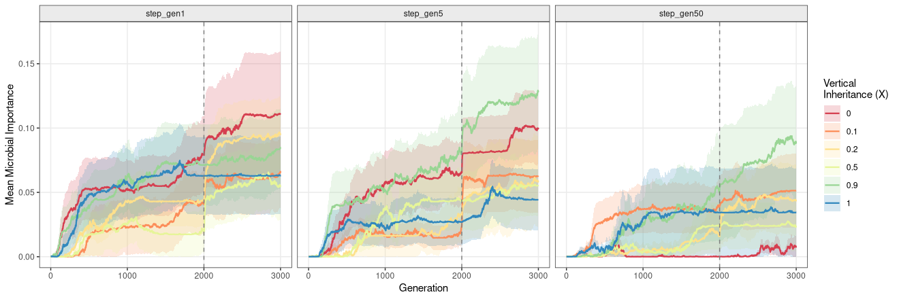

## A9. Statistical models

``` r
m_var <- lm(late_var_ratio ~ evolved_imp * X + EnvType + rep,
            data = late_ratio)
broom::tidy(m_var)   %>% knitr::kable(digits = 3, caption = "Var-ratio: coefficients")
```

| term              | estimate | std.error | statistic | p.value |
|:------------------|---------:|----------:|----------:|--------:|
| (Intercept)       |    0.987 |     0.011 |    93.371 |   0.000 |
| evolved_imp       |    2.153 |     0.054 |    39.710 |   0.000 |
| X                 |    0.002 |     0.011 |     0.203 |   0.839 |
| EnvTypestep_gen5  |    0.003 |     0.008 |     0.307 |   0.759 |
| EnvTypestep_gen50 |   -0.003 |     0.009 |    -0.395 |   0.693 |
| rep               |    0.000 |     0.001 |    -0.231 |   0.818 |
| evolved_imp:X     |   -0.014 |     0.087 |    -0.159 |   0.874 |

Var-ratio: coefficients

``` r
broom::glance(m_var) %>% knitr::kable(digits = 3, caption = "Var-ratio: fit")
```

| r.squared | adj.r.squared | sigma | statistic | p.value | df | logLik | AIC | BIC | deviance | df.residual | nobs |
|---:|---:|---:|---:|---:|---:|---:|---:|---:|---:|---:|---:|
| 0.959 | 0.958 | 0.044 | 641.017 | 0 | 6 | 294.128 | -572.257 | -547.17 | 0.313 | 163 | 170 |

Var-ratio: fit

``` r
anova(m_var) %>% broom::tidy() %>%
  knitr::kable(digits = 3, caption = "Var-ratio: ANOVA")
```

| term          |  df | sumsq | meansq | statistic | p.value |
|:--------------|----:|------:|-------:|----------:|--------:|
| evolved_imp   |   1 | 7.378 |  7.378 |  3845.437 |   0.000 |
| X             |   1 | 0.000 |  0.000 |     0.017 |   0.896 |
| EnvType       |   2 | 0.001 |  0.001 |     0.281 |   0.755 |
| rep           |   1 | 0.000 |  0.000 |     0.058 |   0.810 |
| evolved_imp:X |   1 | 0.000 |  0.000 |     0.025 |   0.874 |
| Residuals     | 163 | 0.313 |  0.002 |        NA |      NA |

Var-ratio: ANOVA

``` r
m_rescue <- lm(rescue_effect ~ evolved_imp * X + EnvType + rep,
               data = late_rescue)
broom::tidy(m_rescue)   %>% knitr::kable(digits = 3, caption = "Rescue: coefficients")
```

| term              | estimate | std.error | statistic | p.value |
|:------------------|---------:|----------:|----------:|--------:|
| (Intercept)       |    0.000 |     0.000 |    -0.408 |   0.683 |
| evolved_imp       |    0.065 |     0.001 |    46.074 |   0.000 |
| X                 |    0.000 |     0.000 |    -0.088 |   0.930 |
| EnvTypestep_gen5  |    0.000 |     0.000 |    -0.117 |   0.907 |
| EnvTypestep_gen50 |    0.000 |     0.000 |    -0.215 |   0.830 |
| rep               |    0.000 |     0.000 |    -0.864 |   0.389 |
| evolved_imp:X     |   -0.007 |     0.002 |    -3.050 |   0.003 |

Rescue: coefficients

``` r
broom::glance(m_rescue) %>% knitr::kable(digits = 3, caption = "Rescue: fit")
```

| r.squared | adj.r.squared | sigma | statistic | p.value | df | logLik | AIC | BIC | deviance | df.residual | nobs |
|---:|---:|---:|---:|---:|---:|---:|---:|---:|---:|---:|---:|
| 0.967 | 0.966 | 0.001 | 806.745 | 0 | 6 | 922.962 | -1829.923 | -1804.837 | 0 | 163 | 170 |

Rescue: fit

``` r
anova(m_rescue) %>% broom::tidy() %>%
  knitr::kable(digits = 3, caption = "Rescue: ANOVA")
```

| term          |  df | sumsq | meansq | statistic | p.value |
|:--------------|----:|------:|-------:|----------:|--------:|
| evolved_imp   |   1 | 0.006 |  0.006 |  4825.588 |   0.000 |
| X             |   1 | 0.000 |  0.000 |     4.237 |   0.041 |
| EnvType       |   2 | 0.000 |  0.000 |     0.125 |   0.883 |
| rep           |   1 | 0.000 |  0.000 |     1.088 |   0.298 |
| evolved_imp:X |   1 | 0.000 |  0.000 |     9.305 |   0.003 |
| Residuals     | 163 | 0.000 |  0.000 |        NA |      NA |

Rescue: ANOVA

# Section B — Standard experiment

``` r
combined_data_all_aggregated <- readr::read_rds(STD_DATA_FILE) %>%
  filter(EnvType %in% c("step_gen1", "step_gen5", "step_gen50")) %>%
  mutate(
    X_Fac     = as.factor(X),
    GenFac    = as.factor(Generation),
    ImportanceNumeric = as.numeric(gsub("importances_init", "", Importance)) * 2,
    ImportanceLabel   = paste0("Importance=", ImportanceNumeric),
    X_label   = case_when(
      X == 0   ~ "No Inheritance (X=0)",
      X == 0.1 ~ "Very Low Inheritance (X=0.1)",
      X == 0.2 ~ "Low Inheritance (X=0.2)",
      X == 0.3 ~ "Low-Moderate Inheritance (X=0.3)",
      X == 0.4 ~ "Moderate Inheritance (X=0.4)",
      X == 0.5 ~ "Moderate Inheritance (X=0.5)",
      X == 0.9 ~ "High Inheritance (X=0.9)",
      X == 1   ~ "Complete Inheritance (X=1)",
      TRUE     ~ paste("X =", X)
    )
  )

cat(sprintf("Loaded %d rows from %s\n",
            nrow(combined_data_all_aggregated), STD_DATA_FILE))
```

    ## Loaded 360720 rows from /nesi/nobackup/uoa04039/Holobiont_PopGen/Simulations_26Nov/simulations_pogen_heatwave/Rerun_sims_array_28Nov/combined_data_all_aggregated.RDS

## B1. Heatmap helpers

``` r
presentation_theme <- function(base_size = 12, base_family = "") {
  theme_minimal(base_size = base_size, base_family = base_family) +
    theme(
      plot.title       = element_text(size = base_size + 2, face = "bold", hjust = 0, margin = margin(b = 10)),
      axis.title       = element_text(size = base_size, face = "bold", color = "black"),
      axis.text        = element_text(size = base_size - 1, color = "black"),
      legend.title     = element_text(size = base_size, face = "bold"),
      legend.text      = element_text(size = base_size - 1),
      legend.position  = "bottom",
      strip.background = element_rect(fill = "gray95", color = "gray80", size = 0.5),
      strip.text       = element_text(size = base_size, face = "bold", color = "black"),
      panel.background = element_rect(fill = "white", color = NA),
      panel.border     = element_rect(color = "gray80", fill = NA, size = 0.5),
      panel.grid       = element_line(color = "gray90", size = 0.3),
      plot.background  = element_rect(fill = "white", color = NA)
    )
}

# Load env to compute env_value column for envplot.
env_list <- readRDS(ENV_FILE)[1:3]
get_env_value <- function(generation, env_type) {
  env_matrix <- env_list[[env_type]]
  env_values <- if (is.matrix(env_matrix)) env_matrix[, 1] else env_matrix
  if (generation <= length(env_values)) env_values[generation] else NA
}

gens_of_int  <- 1900:2100
label_gens   <- gens_of_int[seq(1, length(gens_of_int), by = 50)]

heatmap_data <- combined_data_all_aggregated %>%
  filter(Generation %in% gens_of_int) %>%
  mutate(
    ImportanceLabel = factor(ImportanceLabel,
      levels = unique(ImportanceLabel)[order(as.numeric(gsub(".*=([0-9.]+).*", "\\1",
                                                              unique(ImportanceLabel))))]),
    ImportanceLabel = factor(stringr::str_wrap(ImportanceLabel, width = 20),
      levels = stringr::str_wrap(levels(ImportanceLabel), width = 20)),
    X_label = factor(X_label,
      levels = unique(X_label)[order(as.numeric(gsub(".*=([0-9.]+).*", "\\1",
                                                       unique(X_label))))])
  ) %>%
  rowwise() %>%
  mutate(env_value = get_env_value(Generation, EnvType)) %>%
  ungroup() %>%
  filter(ImportanceNumeric %in% c(0, 0.02, 0.1, 0.2, 0.52, 0.8, 1))

dashed_lines_data <- heatmap_data %>%
  filter(EnvType == "step_gen50") %>%
  distinct(EnvType) %>%
  mutate(generation_line = 2000)

create_heatmap <- function(data, fill_var, fill_name) {
  ggplot(data, aes(x = factor(Generation), y = X_label, fill = !!sym(fill_var))) +
    geom_tile(width = 2, linewidth = 0) +
    geom_vline(data = dashed_lines_data,
               aes(xintercept = match(generation_line, sort(unique(data$Generation)))),
               linetype = "dashed", color = "black", alpha = 0.7) +
    scale_fill_gradient2(
      low = "#4575b4", mid = "#ffffbf", high = "#d73027",
      midpoint = mean(range(data[[fill_var]], na.rm = TRUE)),
      limits   = range(data[[fill_var]], na.rm = TRUE),
      name     = fill_name
    ) +
    scale_x_discrete(breaks = label_gens, labels = label_gens, expand = c(0, 0)) +
    facet_grid(vars(ImportanceLabel), vars(EnvType)) +
    labs(x = "Generation", y = NULL) +
    presentation_theme() +
    theme(
      axis.text.x   = element_text(angle = 90, hjust = 0.5, size = 9),
      axis.text.y   = element_text(size = 9),
      legend.position = "right",
      strip.text.y  = element_text(angle = 0)
    )
}
```

## B2. Heatmap figures

``` r
ne_heatmap            <- create_heatmap(filter(heatmap_data, EnvType == "step_gen50"),
                                        "Ne_mean", "Effective Population Size")
hostfitness_heatmap   <- create_heatmap(heatmap_data, "HostFitness_mean",         "Host Fitness")
microbefitness_heatmap<- create_heatmap(heatmap_data, "AvgMicrobialFitness_mean", "Microbe Fitness")
microbebray_heatmap   <- create_heatmap(heatmap_data, "BrayDiv_mean",             "Bray-Curtis Dissimilarity")
richness_heatmap      <- create_heatmap(heatmap_data, "SpeciesRichness_mean",     "Species Richness")
diversity_heatmap     <- create_heatmap(heatmap_data, "HostAlphaDiversity_mean",  "Alpha Diversity")
polymorphic_heatmap   <- create_heatmap(heatmap_data, "NumPolymorphicLoci_mean",  "Number of Polymorphic Loci")

ne_heatmap
```

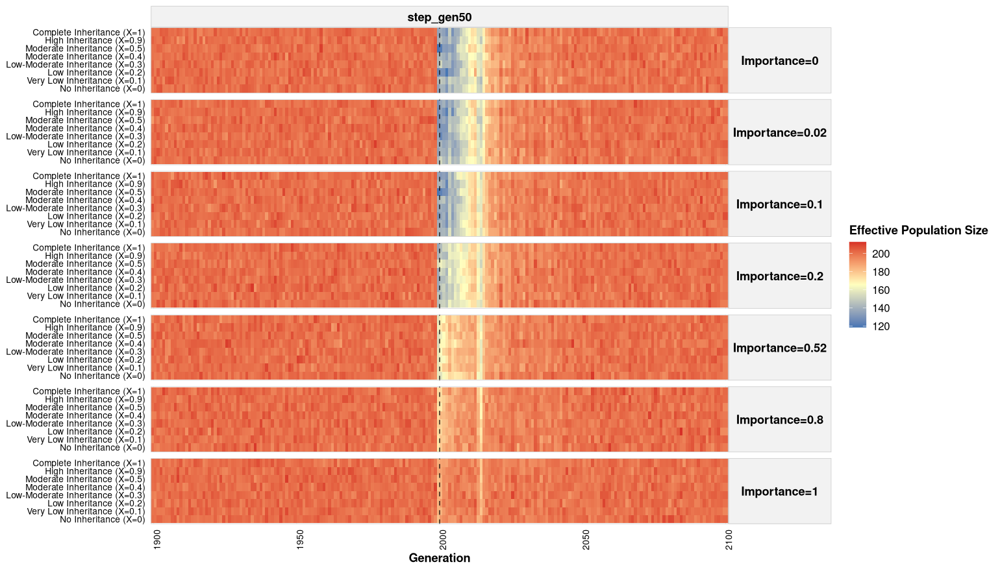

``` r
hostfitness_heatmap
```

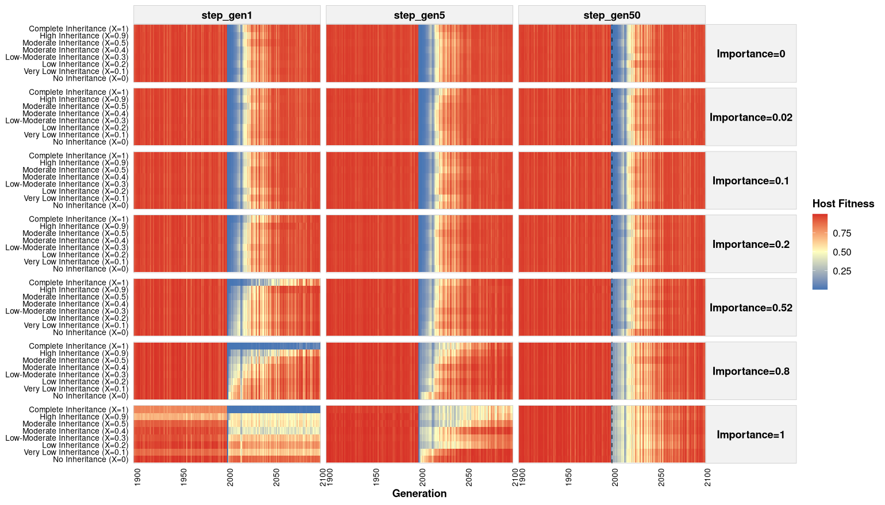

``` r
microbefitness_heatmap
```

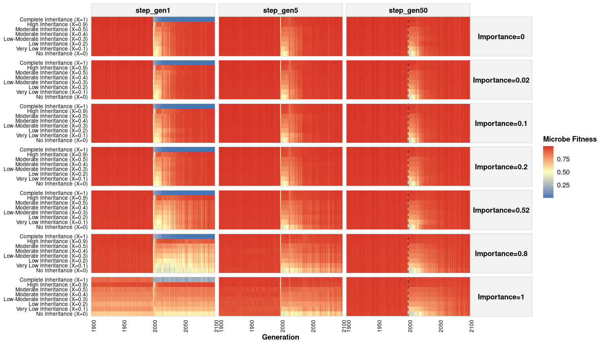

``` r
microbebray_heatmap
```

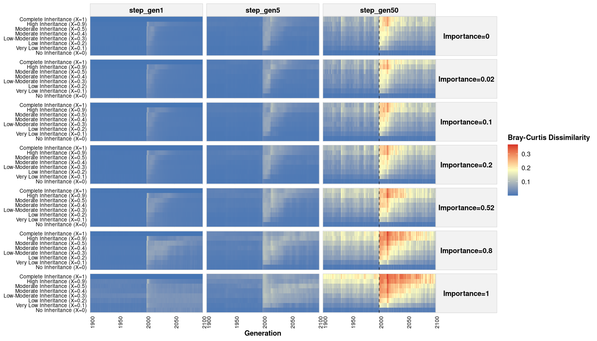

``` r
richness_heatmap
```

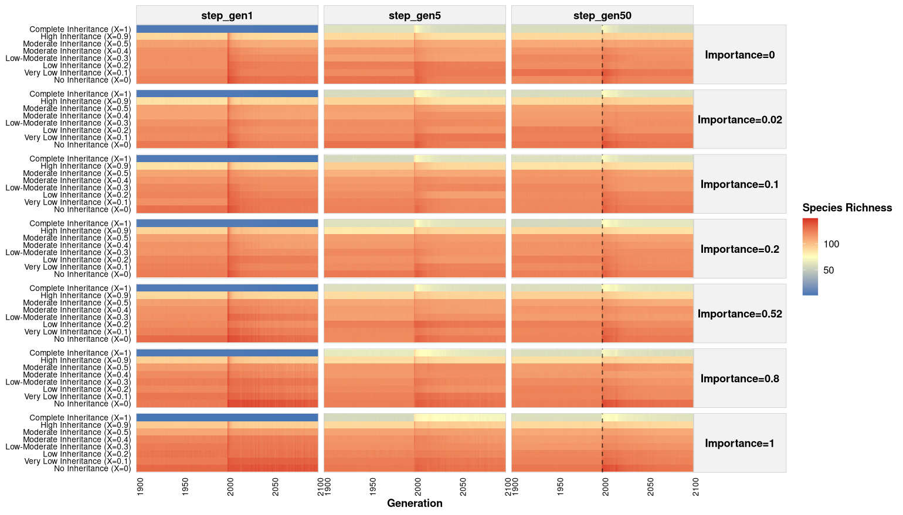

``` r
diversity_heatmap
```

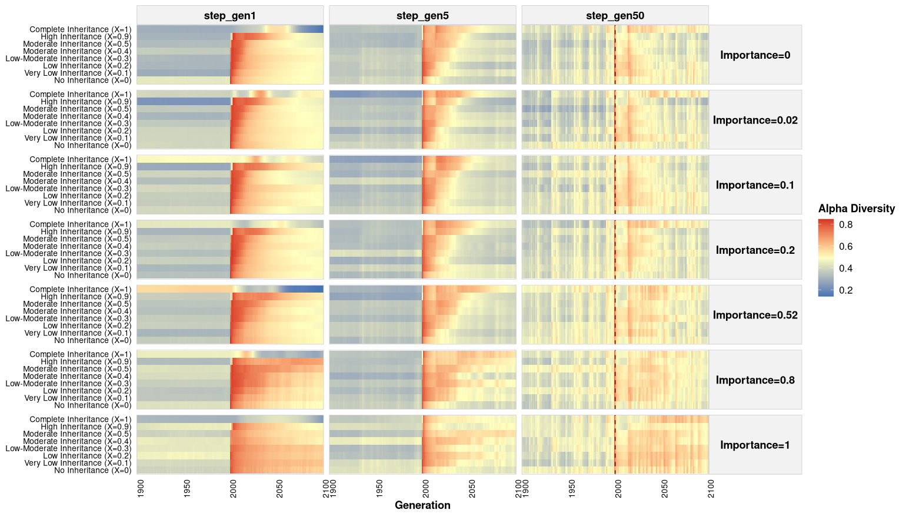

``` r
polymorphic_heatmap
```

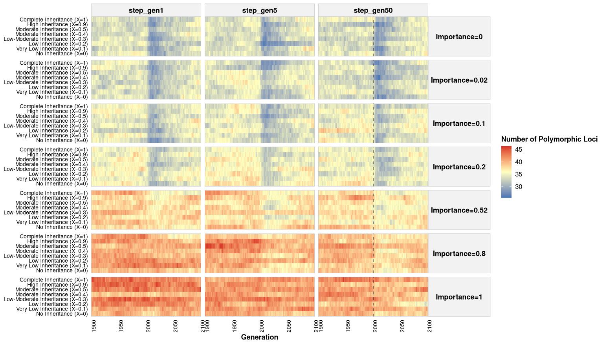

## B3. Importance-as-linear-predictor plots (`step_gen50`, X = 0.9)

``` r
TIME_PERIOD_1_END <- 2000
TIME_PERIOD_2_END <- 2010
PERIOD_1_LABEL <- "Pre-Change (Baseline) (1990-1999)"
PERIOD_2_LABEL <- "Immediate Post Change (2000-2010)"
PERIOD_3_LABEL <- "Late Post Change (2011-2020)"

linear_datasets <- combined_data_all_aggregated %>%
  filter(EnvType == "step_gen50", X == 0.9, Generation %in% 1990:2020) %>%
  mutate(
    time_period = factor(case_when(
      Generation <  TIME_PERIOD_1_END ~ PERIOD_1_LABEL,
      Generation <= TIME_PERIOD_2_END ~ PERIOD_2_LABEL,
      TRUE                            ~ PERIOD_3_LABEL
    ), levels = c(PERIOD_1_LABEL, PERIOD_2_LABEL, PERIOD_3_LABEL)),
    ImportanceNumeric = as.numeric(ImportanceNumeric)
  )

time_colors <- c("#2166AC", "#D73027", "#33A02C")
time_shapes <- c(16, 17, 15)

mk_lm_plot <- function(data, y_var, y_label) {
  ggplot(data, aes(x = ImportanceNumeric, y = !!sym(y_var),
                   color = time_period, shape = time_period)) +
    geom_point(size = 2.5, alpha = 0.1) +
    geom_smooth(method = "lm", se = TRUE, alpha = 0.1, linewidth = 1.2) +
    scale_color_manual(values = time_colors, name = "Time Period") +
    scale_shape_manual(values = time_shapes, name = "Time Period") +
    labs(x = "Microbiome Importance", y = y_label) +
    theme_minimal() +
    theme(legend.direction = "horizontal")
}

ne_LM         <- mk_lm_plot(linear_datasets, "Ne_mean",                 "Ne")
polymorphic_LM<- mk_lm_plot(linear_datasets, "NumPolymorphicLoci_mean", "Number of\nPolymorphic Loci")
Bray_LM       <- mk_lm_plot(linear_datasets, "BrayDiv_mean",            "Bray-Curtis\nDissimilarity")

combined_lm_plot <- (ne_LM + theme(legend.position = "none") |
                     polymorphic_LM + theme(legend.position = "none") |
                     Bray_LM) / guide_area() +
  plot_layout(heights = c(10, 1), guides = "collect") +
  plot_annotation(tag_levels = "a") &
  theme(plot.tag = element_text(size = 16, face = "bold"))

combined_lm_plot
```

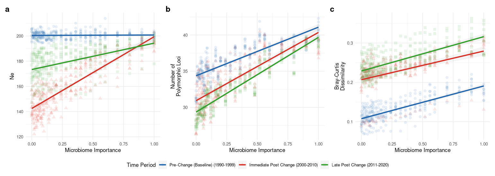

## B4. Three-row metric grid (`step_gen50`, faceted by importance)

Three stacked rows of heatmaps — host fitness, polymorphic loci, and
Bray–Curtis — restricted to `EnvType == "step_gen50"` and to a subset of
importance levels, with one column per importance value labelled (a)
through (r). This is the `step50_labels_outside.png` figure from
`rewritten_analysiscode_Feb10.R`.

``` r
# Prepare step_gen50-only data; n_facets = number of importance levels
# (minus 1 to match the original; letter offsets stride across the rows).
step50_data <- heatmap_data %>% filter(EnvType == "step_gen50")
n_facets    <- length(unique(step50_data$ImportanceLabel)) - 1
step50_data$X_label <- paste0("italic(X) == ", step50_data$X)

create_metric_row <- function(data, fill_var, fill_name, label_offset = 0,
                              show_x_axis = FALSE, show_y_label = FALSE,
                              show_importance = FALSE) {

  unique_levs <- sort(unique(data$ImportanceLabel))
  letter_vec  <- letters[(1:n_facets) + label_offset]
  names(letter_vec) <- unique_levs

  p <- ggplot(data, aes(x = factor(Generation), y = X_label, fill = !!sym(fill_var))) +
    scale_y_discrete(labels = function(x) parse(text = x)) +
    geom_tile(width = 2, linewidth = 0) +
    geom_vline(data = dashed_lines_data,
               aes(xintercept = match(generation_line, sort(unique(data$Generation)))),
               linetype = "dashed", color = "black", alpha = 0.7) +
    scale_fill_gradient2(
      low = "#4575b4", mid = "#ffffbf", high = "#d73027",
      midpoint = mean(range(data[[fill_var]], na.rm = TRUE)),
      name = fill_name
    ) +
    scale_x_discrete(breaks = label_gens, labels = label_gens, expand = c(0, 0)) +
    facet_grid(. ~ ImportanceLabel,
               labeller = labeller(ImportanceLabel = letter_vec)) +
    labs(x = if (show_x_axis) "Generation" else NULL,
         y = if (show_y_label) expression(Vertical ~ Inheritance ~ (italic(X))) else NULL) +
    presentation_theme() +
    theme(
      strip.background = element_blank(),
      strip.text.x     = element_text(size = 12, face = "bold", hjust = 0),
      axis.text.x      = if (show_x_axis) element_text(angle = 90, hjust = 0.5, size = 8) else element_blank(),
      axis.ticks.x     = if (show_x_axis) element_line() else element_blank(),
      axis.text.y      = element_text(size = 8),
      axis.title.y     = if (show_y_label) element_text(size = 12, face = "bold") else element_blank(),
      panel.border     = element_rect(color = "gray80", fill = NA, linewidth = 0.5),
      panel.spacing    = unit(0.5, "lines"),
      legend.position  = "right",
      plot.margin      = margin(b = 2, t = if (show_importance) 25 else 8, l = 5, r = 5)
    )

  if (show_importance) {
    importance_data <- data %>%
      select(ImportanceLabel, ImportanceNumeric) %>%
      distinct() %>%
      arrange(ImportanceLabel)
    n_generations <- length(unique(data$Generation))
    mid_x <- ceiling(n_generations / 2)

    p <- p +
      geom_text(data = importance_data,
                aes(x = mid_x, y = Inf,
                    label = paste0("Importance = ", ImportanceNumeric)),
                inherit.aes = FALSE,
                vjust = -1.5, hjust = 0.5,
                size  = 4, fontface = "italic") +
      coord_cartesian(clip = "off")
  }

  return(p)
}

# Subset of importance levels shown across the three rows
imp_levels_show <- c(0, 0.1, 0.2, 0.52, 0.8, 1)

row1 <- create_metric_row(
  step50_data %>% filter(ImportanceNumeric %in% imp_levels_show),
  "HostFitness_mean", "Host Fitness", 0, FALSE, FALSE, show_importance = TRUE)

row4 <- create_metric_row(
  step50_data %>% filter(ImportanceNumeric %in% imp_levels_show),
  "NumPolymorphicLoci_mean", "Polymorphic Loci", n_facets, FALSE, TRUE)

row2 <- create_metric_row(
  step50_data %>% filter(ImportanceNumeric %in% imp_levels_show),
  "BrayDiv_mean", "Bray-Curtis", n_facets * 2, TRUE, FALSE)

final_plot_external <- (row1 / row4 / row2) +
  plot_layout(guides = "collect") &
  theme(legend.justification = "left")

final_plot_external
```

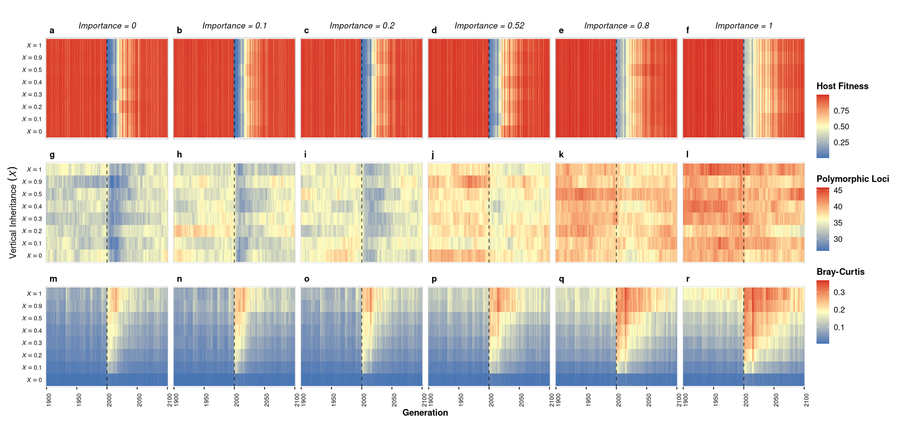

# Saved figures

    ## Saved to /nesi/nobackup/uoa04039/Holobiont_PopGen/Simulations_26Nov/simulations_pogen_heatwave/holobiont-popgen/analysis/figures_rmd:
    ##   diversity_heatmap.png (894.4 KB)
    ##   eff_sel_plot.png (237.1 KB)
    ##   full_combined_plot.png (1021.9 KB)
    ##   hostfitness_heatmap.png (907.9 KB)
    ##   microbebray_heatmap.png (849.1 KB)
    ##   microbefitness_heatmap.png (909.4 KB)
    ##   ne_heatmap.png (756.3 KB)
    ##   plot_combined_unified.png (1730.7 KB)
    ##   polymorphic_heatmap.png (900.8 KB)
    ##   richness_heatmap.png (791.4 KB)
    ##   step50_labels_outside.png (944 KB)
    ##   supp_imp_traj.png (1050.9 KB)

# Session info

``` r
sessionInfo()
```

    ## R version 4.3.2 (2023-10-31)
    ## Platform: x86_64-pc-linux-gnu (64-bit)
    ## Running under: Rocky Linux 9.4 (Blue Onyx)
    ## 
    ## Matrix products: default
    ## BLAS/LAPACK: FlexiBLAS OPENBLAS;  LAPACK version 3.11.0
    ## 
    ## locale:
    ##  [1] LC_CTYPE=en_US.UTF-8       LC_NUMERIC=C               LC_TIME=en_US.UTF-8        LC_COLLATE=en_US.UTF-8     LC_MONETARY=en_US.UTF-8   
    ##  [6] LC_MESSAGES=en_US.UTF-8    LC_PAPER=en_US.UTF-8       LC_NAME=C                  LC_ADDRESS=C               LC_TELEPHONE=C            
    ## [11] LC_MEASUREMENT=en_US.UTF-8 LC_IDENTIFICATION=C       
    ## 
    ## time zone: UTC
    ## tzcode source: system (glibc)
    ## 
    ## attached base packages:
    ## [1] parallel  stats     graphics  grDevices utils     datasets  methods   base     
    ## 
    ## other attached packages:
    ##  [1] digest_0.6.33     vegan_2.6-4       lattice_0.22-5    permute_0.9-7     abind_1.4-5       Rcpp_1.1.0        stringr_1.5.1    
    ##  [8] broom_1.0.5       tidyr_1.3.0       knitr_1.51        data.table_1.17.8 tagger_0.0.0.9000 patchwork_1.3.2   ggplot2_4.0.1    
    ## [15] readr_2.1.4       dplyr_1.1.3      
    ## 
    ## loaded via a namespace (and not attached):
    ##  [1] gtable_0.3.6       xfun_0.56          bslib_0.5.1        tzdb_0.4.0         vctrs_0.6.4        tools_4.3.2        generics_0.1.3    
    ##  [8] tibble_3.2.1       fansi_1.0.5        cluster_2.1.4      pkgconfig_2.0.3    Matrix_1.6-1.1     checkmate_2.3.0    RColorBrewer_1.1-3
    ## [15] S7_0.2.0           lifecycle_1.0.3    compiler_4.3.2     farver_2.1.1       textshaping_0.3.7  htmltools_0.5.7    sass_0.4.7        
    ## [22] yaml_2.3.7         pillar_1.9.0       crayon_1.5.2       jquerylib_0.1.4    MASS_7.3-60        cachem_1.0.8       nlme_3.1-163      
    ## [29] tidyselect_1.2.0   stringi_1.7.12     purrr_1.0.2        labeling_0.4.3     splines_4.3.2      fastmap_1.1.1      grid_4.3.2        
    ## [36] cli_3.6.1          magrittr_2.0.3     dichromat_2.0-0.1  utf8_1.2.4         withr_2.5.2        scales_1.4.0       backports_1.4.1   
    ## [43] rmarkdown_2.25     ragg_1.2.6         hms_1.1.3          evaluate_0.23      mgcv_1.9-0         rlang_1.1.2        glue_1.6.2        
    ## [50] rstudioapi_0.15.0  jsonlite_1.8.7     R6_2.5.1           systemfonts_1.3.1
