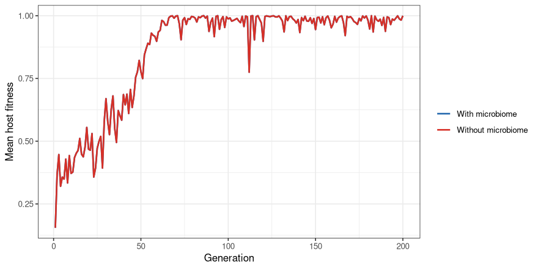
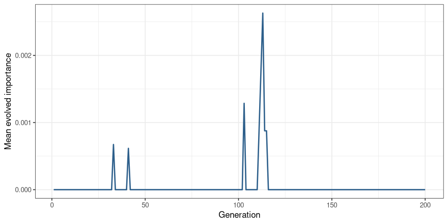
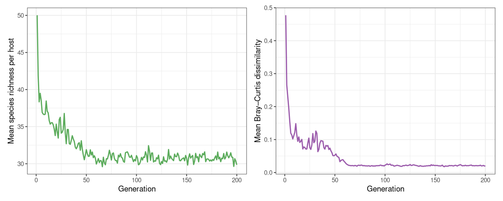
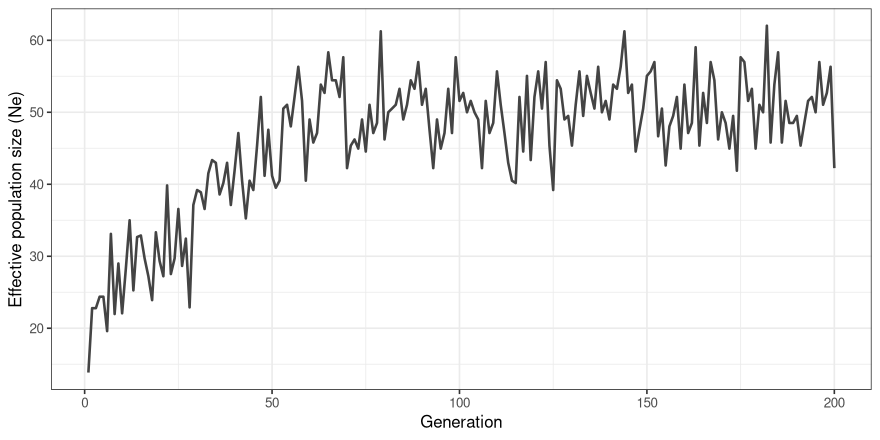

Holobiont Simulation — Local Test Run
================
William Pearman
28 April 2026

- [Overview](#overview)
- [Locate and source the engine](#locate-and-source-the-engine)
- [Set up parameters and initial
  populations](#set-up-parameters-and-initial-populations)
- [Build a small env trajectory](#build-a-small-env-trajectory)
- [Run the simulation](#run-the-simulation)
- [Extract per-generation summaries](#extract-per-generation-summaries)
- [Visualise](#visualise)
  - [Host fitness over time, with and without
    microbiome](#host-fitness-over-time-with-and-without-microbiome)
  - [Mean microbial importance over
    time](#mean-microbial-importance-over-time)
  - [Microbial diversity (species richness and
    Bray–Curtis)](#microbial-diversity-species-richness-and-braycurtis)
  - [Effective population size](#effective-population-size)
- [Session info](#session-info)

# Overview

This Rmd runs a **small live simulation** end-to-end on a single
machine, with no SLURM dependency. The point is to verify the code works
on your system before scaling up.

The simulation engine itself is sourced verbatim from the experiment
code in this repo — this Rmd just supplies parameters and visualises the
output.

``` r
suppressPackageStartupMessages({
  library(Rcpp)
  library(parallel)
  library(dplyr)
  library(readr)
  library(abind)
  library(vegan)
  library(digest)
  library(ggplot2)
  library(tidyr)
})
theme_set(theme_bw(base_size = 11))
```

# Locate and source the engine

``` r
# Find the repo root. When Rmd is in <repo>/analysis/, parent of knit dir
# is the repo root.
RMD_DIR <- if (interactive()) getwd() else dirname(knitr::current_input(dir = TRUE))
REPO_ROOT <- normalizePath(file.path(RMD_DIR, ".."), mustWork = FALSE)
# Fallback: if not in interactive use, try cwd
if (!dir.exists(file.path(REPO_ROOT, params$experiment))) {
  REPO_ROOT <- normalizePath(".", mustWork = FALSE)
}
EXP_DIR <- file.path(REPO_ROOT, params$experiment)

stopifnot("Experiment directory not found — check the 'experiment' param" = dir.exists(EXP_DIR))

cat("REPO_ROOT: ", REPO_ROOT, "\n",
    "EXP_DIR:   ", EXP_DIR,   "\n", sep = "")
```

    ## REPO_ROOT: /nesi/nobackup/uoa04039/Holobiont_PopGen/Simulations_26Nov/simulations_pogen_heatwave/holobiont-popgen
    ## EXP_DIR:   /nesi/nobackup/uoa04039/Holobiont_PopGen/Simulations_26Nov/simulations_pogen_heatwave/holobiont-popgen/importance_mutation

``` r
# Compile each Rcpp file. Each call defines a separate translation unit,
# which is why some helper functions (rmultinom_cpp, fitness_func_*) are
# defined in multiple .cpp files — that's intentional and works fine.
Rcpp::sourceCpp(file.path(EXP_DIR, "withingen_process.cpp"))
Rcpp::sourceCpp(file.path(EXP_DIR, "calccpp_fit.cpp"))
Rcpp::sourceCpp(file.path(EXP_DIR, "env_production_withingen.cpp"))
Rcpp::sourceCpp(file.path(EXP_DIR, "simulate_mating_cpp.cpp"))
Rcpp::sourceCpp(file.path(EXP_DIR, "create_offspring_loop.cpp"))
Rcpp::sourceCpp(file.path(EXP_DIR, "mutate_trait.cpp"))
source(file.path(EXP_DIR, "corefunctions.R"))

cat("Engine sourced successfully.\n")
```

    ## Engine sourced successfully.

# Set up parameters and initial populations

The simulation engine looks up `Host_PopSize` as a global in the calling
environment, so we define it here at the top level along with the rest
of the population sizes.

``` r
Host_PopSize    <- params$host_pop_size
N_Species       <- params$n_species
nhost_gens      <- params$n_generations
MicrobePopSize  <- params$microbe_pop_size
EnvPoolSize     <- params$env_pool_size

LOCI_COUNT          <- params$n_loci
IMPORTANCE_VALUE    <- params$initial_importance
WEIGHT_VALUE        <- params$weight_value
MUTATION_RATE       <- as.numeric(params$mutation_rate)

VERTICAL_INHERITANCE <- params$vertical_inheritance
ENV_SELF_SEEDING     <- params$env_self_seeding
HOST_CONTRIBUTION    <- params$host_contribution
SELECTION_STRENGTH   <- params$selection_strength
```

``` r
set.seed(1)

# 1. Initial host-microbe population (each column is one host)
InitPopulation <- matrix(nrow = N_Species, ncol = Host_PopSize)
InitPopulation <- apply(InitPopulation, 2, function(x) {
  rmultinom(n = 1, size = MicrobePopSize, prob = rep(1 / N_Species, N_Species))
})
rownames(InitPopulation) <- paste("Microbe", 1:N_Species, sep = "_")
colnames(InitPopulation) <- paste("Host",    1:Host_PopSize, sep = "_")

# 2. Environmental pool (uniform start)
EnvPool <- rep(EnvPoolSize / N_Species, N_Species)
names(EnvPool) <- paste("Microbe", 1:N_Species, sep = "_")
fixed_envpool <- EnvPool

# 3. Random microbe trait values
traitpool_microbes <- runif(N_Species, -2.5, 2.5)
names(traitpool_microbes) <- paste("Microbe", 1:N_Species, sep = "_")

# 4. Host genetic optimum array (Host_PopSize × 2 × n_loci)
host_microbe_optima <- abind(
  lapply(1:LOCI_COUNT, function(x) {
    matrix(sample(c(-2.5, 2.5), 2 * Host_PopSize, replace = TRUE),
           ncol = 2, nrow = Host_PopSize)
  }), along = 3
)
dimnames(host_microbe_optima) <- list(
  paste("Host",  1:Host_PopSize, sep = "_"),
  c("Allele_1", "Allele_2"),
  paste("Locus", 1:LOCI_COUNT,   sep = "_")
)

# 5. Microbial-importance array (Host_PopSize × 2 × 1 locus)
microbiome_importances <- abind(
  lapply(1, function(x) {
    matrix(IMPORTANCE_VALUE, ncol = 2, nrow = Host_PopSize)
  }), along = 3
)
dimnames(microbiome_importances) <- list(
  paste("Host", 1:Host_PopSize, sep = "_"),
  c("Allele_1", "Allele_2"),
  "Locus_1"
)

# 6. Within-generation weighting array (Host_PopSize × 2 × 50 loci)
host_env_weightings <- abind(
  lapply(1:50, function(x) {
    matrix(WEIGHT_VALUE, ncol = 2, nrow = Host_PopSize)
  }), along = 3
)
dimnames(host_env_weightings) <- list(
  paste("Host",  1:Host_PopSize, sep = "_"),
  c("Allele_1", "Allele_2"),
  paste("Locus", 1:50,           sep = "_")
)

cat("Populations initialised:\n",
    sprintf("  HostPopulation:         %d × %d (microbes × hosts)\n",
            nrow(InitPopulation), ncol(InitPopulation)),
    sprintf("  host_microbe_optima:    %d × %d × %d\n",
            dim(host_microbe_optima)[1], dim(host_microbe_optima)[2],
            dim(host_microbe_optima)[3]),
    sprintf("  microbiome_importances: %d × %d × %d\n",
            dim(microbiome_importances)[1], dim(microbiome_importances)[2],
            dim(microbiome_importances)[3]),
    sprintf("  host_env_weightings:    %d × %d × %d\n",
            dim(host_env_weightings)[1], dim(host_env_weightings)[2],
            dim(host_env_weightings)[3]),
    sep = "")
```

    ## Populations initialised:
    ##   HostPopulation:         200 × 50 (microbes × hosts)
    ##   host_microbe_optima:    50 × 2 × 20
    ##   microbiome_importances: 50 × 2 × 1
    ##   host_env_weightings:    50 × 2 × 50

# Build a small env trajectory

We grab the requested EnvType from the bundled `data/env_list_rerun.RDS`
and truncate it to `n_generations` rows.

``` r
ENV_FILE <- file.path(REPO_ROOT, "data", "env_list_rerun.RDS")
stopifnot("data/env_list_rerun.RDS not found" = file.exists(ENV_FILE))

env_full   <- read_rds(ENV_FILE)
stopifnot(params$env_type %in% names(env_full))

env_matrix <- env_full[[params$env_type]][1:nhost_gens, , drop = FALSE]
cat("Using env type '", params$env_type, "' truncated to ", nrow(env_matrix),
    " host gens × ", ncol(env_matrix), " microbial gens.\n", sep = "")
```

    ## Using env type 'step_gen5' truncated to 200 host gens × 5 microbial gens.

# Run the simulation

``` r
XY <- as.numeric(c(VERTICAL_INHERITANCE, ENV_SELF_SEEDING, HOST_CONTRIBUTION,
                   SELECTION_STRENGTH, SELECTION_STRENGTH, SELECTION_STRENGTH))

start_time <- Sys.time()

sim_result <- lapply_wrapper_CPP(
  XY = XY,
  HostPopulation               = InitPopulation,
  N_Microbes                   = MicrobePopSize,
  envpoolsize                  = EnvPoolSize,
  env_pool                     = EnvPool,
  generations                  = nrow(env_matrix),
  fixed_envpool                = fixed_envpool,
  selection_parameter_hosts    = XY[4],
  selection_parameter_microbes = XY[5],
  selection_parameter_env      = XY[6],
  traitpool_microbes           = traitpool_microbes,
  host_microbe_optima          = host_microbe_optima,
  env_cond_val                 = env_matrix,
  N_Species                    = N_Species,
  microbiome_importances       = microbiome_importances,
  per_host_bac_gens            = ncol(env_matrix),
  self_seed_prop               = 0.98,
  generation_data_file         = NA,
  mutation_rate_optima         = 1e-4,
  mutation_rate_importance     = 1e-4,
  print_currentgen             = FALSE,
  importances_mutation         = TRUE,
  optima_mutate                = TRUE,
  nloci                        = LOCI_COUNT,
  nloci_importance             = 1,
  host_env_weightings          = host_env_weightings,
  lineage_track                = FALSE,
  Test_HWE                     = FALSE,
  metabolic_cost               = 0
)
```

    ## [1] "Current X Value is 0.5 Current EnvCon value is 0.9"

``` r
duration <- as.numeric(difftime(Sys.time(), start_time, units = "secs"))
cat(sprintf("\nSimulation finished in %.1f seconds (%d generations × %d hosts × %d species)\n",
            duration, nhost_gens, Host_PopSize, N_Species))
```

    ## 
    ## Simulation finished in 3.5 seconds (200 generations × 50 hosts × 200 species)

# Extract per-generation summaries

``` r
# sim_result is a list with one named element (the parameter combo);
# inside that, $GenData is the per-generation list.
gen_data <- sim_result[[1]]$GenData
n_gens   <- length(gen_data)

gen_summary <- do.call(rbind, lapply(seq_len(n_gens), function(g) {
  x <- gen_data[[g]]
  data.frame(
    generation         = g,
    mean_host_fitness  = mean(x$HostFitness, na.rm = TRUE),
    mean_nomicro_fit   = mean(x$nomicrobiomehost_fitnessvector, na.rm = TRUE),
    sd_host_fitness    = sd(x$HostFitness, na.rm = TRUE),
    mean_importance    = mean(x$microbiome_importances_used, na.rm = TRUE),
    mean_microbe_trait = mean(x$mean_microbial_trait_vals, na.rm = TRUE),
    species_richness   = mean(x$species_richess, na.rm = TRUE),
    Ne                 = x$Ne,
    bray_div           = mean(x$BrayDiv, na.rm = TRUE),
    obs_het            = if (is.list(x$optima_Observed_heterozygosity))
                            x$optima_Observed_heterozygosity$mean_heterozygosity
                         else x$optima_Observed_heterozygosity
  )
}))
knitr::kable(head(gen_summary, 10),
             caption = "Per-generation summary (head)", digits = 4)
```

| generation | mean_host_fitness | mean_nomicro_fit | sd_host_fitness | mean_importance | mean_microbe_trait | species_richness | Ne | bray_div | obs_het |
|---:|---:|---:|---:|---:|---:|---:|---:|---:|---:|
| 1 | 0.1550 | 0.1550 | 0.2641 | 0 | 0.0618 | 50.02 | 13.8418 | 0.4774 | 0.494 |
| 2 | 0.3679 | 0.3679 | 0.3636 | 0 | 0.0025 | 41.92 | 22.7907 | 0.2656 | 0.493 |
| 3 | 0.4467 | 0.4467 | 0.4069 | 0 | 0.0286 | 38.34 | 22.7907 | 0.2304 | 0.501 |
| 4 | 0.3206 | 0.3206 | 0.3657 | 0 | 0.0462 | 39.50 | 24.3781 | 0.1957 | 0.490 |
| 5 | 0.3567 | 0.3567 | 0.3793 | 0 | 0.0115 | 38.56 | 24.3781 | 0.1545 | 0.449 |
| 6 | 0.3491 | 0.3491 | 0.3753 | 0 | 0.0537 | 36.92 | 19.6000 | 0.1194 | 0.433 |
| 7 | 0.4284 | 0.4284 | 0.3989 | 0 | 0.0469 | 36.70 | 33.1081 | 0.1138 | 0.409 |
| 8 | 0.3338 | 0.3338 | 0.3474 | 0 | 0.0611 | 36.62 | 21.9731 | 0.1018 | 0.450 |
| 9 | 0.4425 | 0.4425 | 0.4189 | 0 | 0.0516 | 36.68 | 28.9941 | 0.1116 | 0.402 |
| 10 | 0.3718 | 0.3718 | 0.4064 | 0 | 0.0465 | 38.46 | 22.0721 | 0.1218 | 0.374 |

Per-generation summary (head)

# Visualise

## Host fitness over time, with and without microbiome

``` r
gen_summary %>%
  pivot_longer(c(mean_host_fitness, mean_nomicro_fit),
               names_to = "type", values_to = "fitness") %>%
  mutate(type = recode(type,
                       mean_host_fitness = "With microbiome",
                       mean_nomicro_fit  = "Without microbiome")) %>%
  ggplot(aes(generation, fitness, colour = type)) +
  geom_line(linewidth = 0.8) +
  scale_colour_manual(values = c("With microbiome" = "#2166AC",
                                 "Without microbiome" = "#D73027"),
                      name = NULL) +
  labs(x = "Generation", y = "Mean host fitness")
```



## Mean microbial importance over time

If `importances_mutation = TRUE` and the initial importance is 0, you
should see importance drift up if the microbiome confers a fitness
advantage (and stay flat-ish under neutral conditions).

``` r
ggplot(gen_summary, aes(generation, mean_importance)) +
  geom_line(linewidth = 0.8, colour = "#2D5F8B") +
  labs(x = "Generation", y = "Mean evolved importance")
```



## Microbial diversity (species richness and Bray–Curtis)

``` r
p_rich <- ggplot(gen_summary, aes(generation, species_richness)) +
  geom_line(linewidth = 0.8, colour = "#5BAB5B") +
  labs(x = "Generation", y = "Mean species richness per host")

p_bray <- ggplot(gen_summary, aes(generation, bray_div)) +
  geom_line(linewidth = 0.8, colour = "#9B5BAB") +
  labs(x = "Generation", y = "Mean Bray–Curtis dissimilarity")

if (requireNamespace("patchwork", quietly = TRUE)) {
  patchwork::wrap_plots(p_rich, p_bray, nrow = 1)
} else {
  p_rich; p_bray
}
```



## Effective population size

``` r
ggplot(gen_summary, aes(generation, Ne)) +
  geom_line(linewidth = 0.8, colour = "#444444") +
  labs(x = "Generation", y = "Effective population size (Ne)")
```



# Session info

``` r
sessionInfo()
```

    ## R version 4.3.2 (2023-10-31)
    ## Platform: x86_64-pc-linux-gnu (64-bit)
    ## Running under: Rocky Linux 9.4 (Blue Onyx)
    ## 
    ## Matrix products: default
    ## BLAS/LAPACK: FlexiBLAS OPENBLAS;  LAPACK version 3.11.0
    ## 
    ## locale:
    ##  [1] LC_CTYPE=en_US.UTF-8       LC_NUMERIC=C              
    ##  [3] LC_TIME=en_US.UTF-8        LC_COLLATE=en_US.UTF-8    
    ##  [5] LC_MONETARY=en_US.UTF-8    LC_MESSAGES=en_US.UTF-8   
    ##  [7] LC_PAPER=en_US.UTF-8       LC_NAME=C                 
    ##  [9] LC_ADDRESS=C               LC_TELEPHONE=C            
    ## [11] LC_MEASUREMENT=en_US.UTF-8 LC_IDENTIFICATION=C       
    ## 
    ## time zone: UTC
    ## tzcode source: system (glibc)
    ## 
    ## attached base packages:
    ## [1] parallel  stats     graphics  grDevices utils     datasets  methods  
    ## [8] base     
    ## 
    ## other attached packages:
    ##  [1] tidyr_1.3.0    ggplot2_4.0.1  digest_0.6.33  vegan_2.6-4    lattice_0.22-5
    ##  [6] permute_0.9-7  abind_1.4-5    readr_2.1.4    dplyr_1.1.3    Rcpp_1.1.0    
    ## 
    ## loaded via a namespace (and not attached):
    ##  [1] Matrix_1.6-1.1     gtable_0.3.6       compiler_4.3.2     tidyselect_1.2.0  
    ##  [5] dichromat_2.0-0.1  cluster_2.1.4      splines_4.3.2      scales_1.4.0      
    ##  [9] yaml_2.3.7         fastmap_1.1.1      R6_2.5.1           patchwork_1.3.2   
    ## [13] labeling_0.4.3     generics_0.1.3     knitr_1.51         MASS_7.3-60       
    ## [17] tibble_3.2.1       RColorBrewer_1.1-3 pillar_1.9.0       tzdb_0.4.0        
    ## [21] rlang_1.1.2        utf8_1.2.4         xfun_0.56          S7_0.2.0          
    ## [25] cli_3.6.1          withr_2.5.2        magrittr_2.0.3     mgcv_1.9-0        
    ## [29] grid_4.3.2         rstudioapi_0.15.0  hms_1.1.3          lifecycle_1.0.3   
    ## [33] nlme_3.1-163       vctrs_0.6.4        evaluate_0.23      glue_1.6.2        
    ## [37] farver_2.1.1       fansi_1.0.5        purrr_1.0.2        rmarkdown_2.25    
    ## [41] tools_4.3.2        pkgconfig_2.0.3    htmltools_0.5.7
